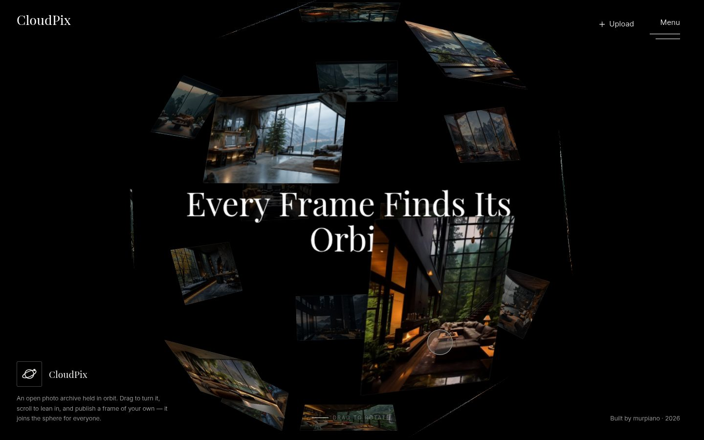

# CloudPix

**A photo archive that lives on a sphere.** Drag the globe of frames, scroll to lean in, open any
shot in a lightbox, sort the flat archive, and publish your own frame with effects rendered in the
browser.



**Live:** https://murpiano.github.io/cloudpix-platform/

> The backend runs on a free Render instance that falls asleep when idle. The first visit can take
> up to a minute; the loading screen and the upload form say so while the server wakes up. Frames
> uploaded by visitors live until the instance restarts.

## Highlights

- **3D frame sphere without WebGL.** Cards sit on a Fibonacci lattice and are placed with CSS 3D
  transforms. Drags build up a rotation matrix (a trackball, not yaw/pitch angles), so the sphere
  turns freely in any direction, over the poles too, with mouse, pen or touch. Every card is
  re-oriented through the perspective projection, so no photo is ever shown upside down. A single
  `requestAnimationFrame` loop drives inertia, a scroll dolly and per-card depth shading. It writes
  to the DOM only when a value changes.
- **FLIP lightbox.** A frame grows out of the exact card or tile you clicked and returns there on
  close. ← / → cross-fade between frames on two stacked layers. The picture box has a fixed size,
  so paging never makes it jump. The decoded thumbnail shows at once, and the full-size file
  replaces it when it loads. Comments scroll inside their own panel.
- **Studio with baked effects.** Five looks (Mono, Noir, Vintage, Glow, Soft Blur), strength and
  centre crop preview live with CSS filters. On publish, a canvas renders the same filter chain
  into a JPEG. The archive shows exactly what the author saw.
- **Archive grid.** Sort by latest, likes, discussion or shuffle. The grid animates the reorder with
  the View Transitions API where the browser supports it.
- **Images decoded once.** Each photo is downscaled on a canvas to what a card needs, then shared by
  the sphere, the grid and the lightbox.
- **Typed data boundary.** Server payloads are validated and normalised in one place
  (`src/api/parse.ts`), so the UI works only with clean `Photo` objects.
- **Accessible by default.** The grid and dialogs work from the keyboard, focus returns to where it
  came from, and reduced-motion preferences are respected.

## Stack

| Layer    | Choice                                         |
| -------- | ---------------------------------------------- |
| Language | TypeScript (strict), no UI framework           |
| Styles   | SCSS: tokens, fluid type helpers, media mixins |
| Build    | Vite                                           |
| Quality  | Vitest, ESLint (typescript-eslint), Prettier   |
| Delivery | GitHub Actions → GitHub Pages                  |

## Project layout

```text
src/
├── api/          # fetch client, payload parsing, domain types
├── app/          # page-level state: body flags, likes
├── features/
│   ├── orbit/    # sphere layout (pure) + camera, drag, depth
│   ├── archive/  # flat grid with sorting
│   ├── viewer/   # FLIP lightbox, comment thread
│   ├── studio/   # upload flow: effects, tags, canvas bake, drop anywhere
│   ├── splash/   # loading screen, server wake-up state
│   ├── menu/  chrome/  cursor/  toast/
├── lib/          # DOM helpers, sorting, decoding, icons, storage
├── styles/       # normalize, tokens, globals, utilities, SCSS helpers
└── main.ts       # wires the features together
```

Each feature owns its markup hooks, its logic and its `.scss` file. The pure parts (sphere maths,
sorting, tag rules, crop planning, effect filters, payload parsing) have unit tests next to them.

## Getting started

```bash
git clone https://github.com/murpiano/cloudpix-platform.git
cd cloudpix-platform
npm install
npm run dev        # http://localhost:3000
```

| Script            | Purpose                             |
| ----------------- | ----------------------------------- |
| `npm run dev`     | Start the dev server                |
| `npm run build`   | Type-check and build to `dist/`     |
| `npm run preview` | Serve the production build          |
| `npm run check`   | Type-check, lint and run unit tests |
| `npm test`        | Run unit tests                      |

## API

The app talks to `https://bvtrots-test-server.onrender.com/cloudpix-platform`:

| Method | Path      | Body                                                                                            |
| ------ | --------- | ----------------------------------------------------------------------------------------------- |
| GET    | `/data`   | –                                                                                               |
| POST   | `/upload` | `multipart/form-data`: `filename`, `scale`, `effect`, `effect-level`, `hashtags`, `description` |

## Author

Bogdan Trotsenko ([@murpiano](https://github.com/murpiano)) · [Telegram](https://t.me/murpiano)

Released under the [MIT License](LICENSE).
